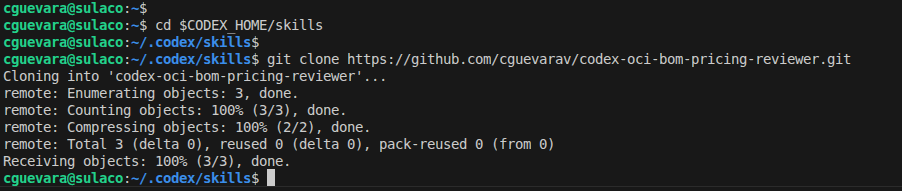
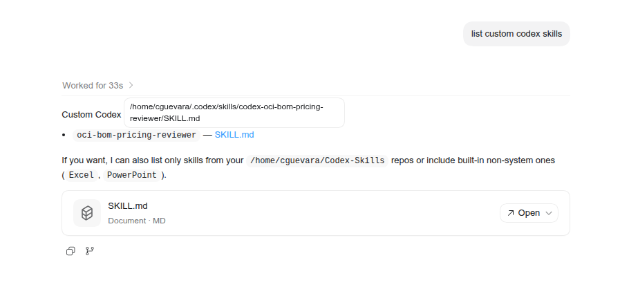
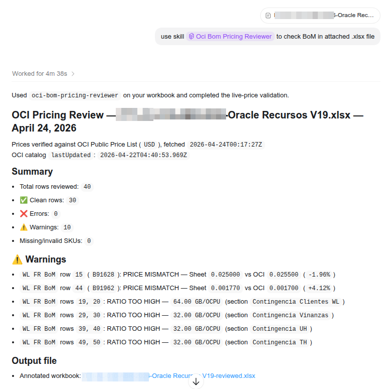

# OCI BoM / Pricing Reviewer (Codex Skill)

This skill reviews Oracle Cloud Infrastructure (OCI) pricing spreadsheets
against live OCI list prices from Oracle's public API. It targets BoM and
cost-estimate workbooks authored by solution engineers.

## What the skill checks

| # | Check | Severity |
|---|-------|----------|
| A | SKU / part number exists in current OCI catalog | Error |
| B | Unit price matches current OCI list price (all deltas flagged) | Warning |
| C | Unit of measure matches API `metricName` | Warning |
| D | OCPU SKUs include paired memory SKU when required | Error |
| E | OCPU:memory ratio is between 1:4 and 1:16 GB per OCPU | Warning |
| F | Row math: `qty x unit_price = line_total` | Error |
| G | Subtotals and grand totals are consistent | Error |
| H | Monthly hours are standard (720/730/744) and sheet-consistent | Error |
| I | Currency consistency within and across sheets | Error / Warning |

Full behavior and validation rules are defined in [SKILL.md](SKILL.md).

## Outputs

Each run produces:
1. A structured in-chat review report (errors, warnings, clean rows, notes).
2. An annotated workbook `<original-filename>-reviewed.xlsx` saved next to the
   source file, with red/yellow fills and comments on flagged cells.

The report always includes the absolute path of the annotated workbook.

## Install in Codex

Step 1. Go to Codex skills folder and clone the skill repository:

```bash
cd $CODEX_HOME/skills
git clone https://github.com/cguevarav/codex-oci-bom-pricing-reviewer
```



Step 2. Use Codex to confirm the cloned repository was installed as a Skill:




Restart Codex after installation to pick up the new skill.

## Use in Codex

1. Place the `.xlsx` workbook in your workspace.
2. Ask Codex to use skill "OCI Bom Pricing Reviewer" to check BoM in attached .xlsx file

3. The results should be similas as shown below:



3. Codex runs live validation against Oracle's OCI pricing API and returns:
   - In-chat findings with exact discrepancies
   - Annotated reviewed workbook path

## Requirements

- Outbound HTTPS access to:
  `https://apexapps.oracle.com/pls/apex/cetools/api/v1/products/`
- Input workbook in `.xlsx` format (openpyxl-readable)
- Live OCI API reachability (no offline fallback)

## Repository layout

| Path | Purpose |
|------|---------|
| [SKILL.md](SKILL.md) | Skill metadata and workflow instructions |
| [references/oci-sku-pairing-rules.md](references/oci-sku-pairing-rules.md) | SKU pairing rules used by checks |
| [images/](images/) | Screenshots from installation |
| [LICENSE](LICENSE) | MIT license |

## License

MIT - see [LICENSE](LICENSE).
